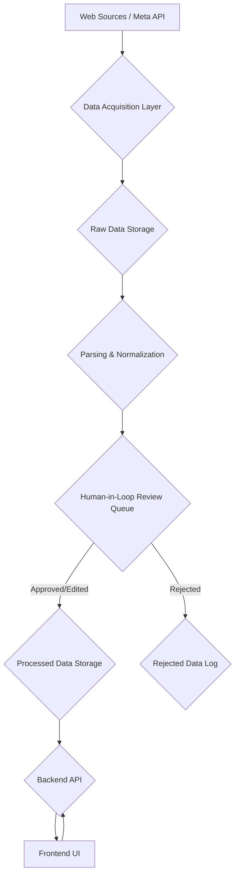

# Product Requirements Document - Project Amber

## 1. Introduction
### 1.1 Purpose
Project Amber aims to provide a comprehensive platform for [**Insert Project Amber's Core Purpose Here - e.g., social media analytics, expense tracking, data aggregation**]. It will leverage advanced data acquisition techniques and a robust user interface to deliver actionable insights and efficient data management.

### 1.2 High-Level Goals
*   To accurately collect and process data from various online sources.
*   To provide a user-friendly and interactive interface for data visualization and management.
*   To ensure data integrity, security, and privacy.
*   To support a human-in-the-loop review process for data validation.

## 2. Atomic Tasks & Features

This section outlines the project's features broken down into granular, atomic tasks. Each task is designed to be independently implementable and testable.

### 2.1 Core Data Acquisition
*   **Task ID:** DA-001
    *   **Description:** Implement web scraping module for initial data source (e.g., Twitter public profiles).
    *   **Acceptance Criteria:**
        *   Module successfully extracts specified data fields (e.g., username, post content, timestamp, likes, shares) from target URLs.
        *   Handles basic pagination and rate limiting.
        *   Outputs raw data in a structured format (JSON).
    *   **Dependencies:** DA-002, BE-001
    *   **Priority:** High
*   **Task ID:** DA-002
    *   **Description:** Implement data parsing and normalization logic for scraped data.
    *   **Acceptance Criteria:**
        *   Raw scraped data is transformed into a consistent internal data model.
        *   Handles missing or malformed data gracefully.
        *   Outputs clean, validated data.
        *   Persists provider identifiers (e.g., `platformPostId`) into canonical storage columns for deduplication.
    *   **Dependencies:** DA-001, BE-001
    *   **Priority:** High
*   **Task ID:** DA-003
    *   **Description:** Integrate with Business Meta API for a specific data source (e.g., Facebook Pages API).
    *   **Acceptance Criteria:**
        *   Successfully authenticates with the Meta API using provided credentials.
        *   Retrieves specified data fields (e.g., page posts, comments, reactions).
        *   Handles API rate limits and errors.
        *   Outputs raw API data in a structured format (JSON).
    *   **Dependencies:** DA-004, BE-001
    *   **Priority:** High
*   **Task ID:** DA-004
    *   **Description:** Implement data parsing and normalization logic for Business Meta API data.
    *   **Acceptance Criteria:**
        *   Raw API data is transformed into the consistent internal data model.
        *   Handles API-specific data structures and potential inconsistencies.
        *   Outputs clean, validated data.
    *   **Dependencies:** DA-003, BE-001
    *   **Priority:** High
    *   **Notes (2025-10-06):** Phase 1 Graph ingestion now prioritizes Graph posts when `FACEBOOK_GRAPH_ENABLED=1`, persisting `platformPostId`, `mediaUrl`, and `avatarUrl` while falling back to news or sample content on failure. Coverage: `tests/test_facebook_ingestion.py`.

### 2.2 Human-in-Loop Review
*   **Task ID:** HL-001
    *   **Description:** Develop backend API endpoint for submitting data for human review.
    *   **Acceptance Criteria:**
        *   API accepts data payload and marks it as 'pending review'.
        *   Stores data in a dedicated review queue in the database.
    *   **Dependencies:** BE-002
    *   **Priority:** Medium
*   **Task ID:** HL-002
    *   **Description:** Develop frontend UI for displaying data awaiting human review.
    *   **Acceptance Criteria:**
        *   Displays a list of data entries marked 'pending review'.
        *   Each entry shows relevant fields for review (e.g., original scraped text, parsed fields).
        *   Provides options to 'Approve', 'Reject', or 'Edit' each entry.
    *   **Dependencies:** HL-001, FE-005
    *   **Priority:** Medium
*   **Task ID:** HL-003
    *   **Description:** Implement backend API endpoints for 'Approve', 'Reject', and 'Edit' actions on reviewed data.
    *   **Acceptance Criteria:**
        *   'Approve' moves data to 'processed' state.
        *   'Reject' moves data to 'rejected' state (with optional reason).
        *   'Edit' updates data fields and moves to 'processed' state.
        *   All actions are logged with reviewer ID and timestamp.
    *   **Dependencies:** HL-002, BE-002
    *   **Priority:** Medium

### 2.3 Frontend UI Components (Referencing Project Dhruv)
*   **Task ID:** FE-001
    *   **Description:** Implement a responsive Header component.
    *   **Acceptance Criteria:**
        *   Displays project/group name.
        *   Includes navigation elements (e.g., Home, Settings, Share).
        *   Incorporates user avatar/profile display.
        *   Responsive across desktop and mobile viewports.
    *   **Dependencies:** FE-002, FE-003, FE-004
    *   **Priority:** High
*   **Task ID:** FE-002
    *   **Description:** Implement reusable Icon components (e.g., SettingsIcon, HomeIcon, PlusIcon, ShareIcon).
    *   **Acceptance Criteria:**
        *   Icons are SVG-based for scalability.
        *   Easily customizable (size, color) via props.
        *   Consistent visual style.
    *   **Dependencies:** None
    *   **Priority:** High
*   **Task ID:** FE-003
    *   **Description:** Implement an Avatar component for displaying user/member profiles.
    *   **Acceptance Criteria:**
        *   Displays user image or initials.
        *   Supports different sizes (e.g., 'sm', 'md', 'lg').
        *   Fallback for missing images.
    *   **Dependencies:** None
    *   **Priority:** Medium
*   **Task ID:** FE-004
    *   **Description:** Implement a ShareModal component.
    *   **Acceptance Criteria:**
        *   Modal opens/closes correctly.
        *   Displays captured image data (e.g., dashboard summary).
        *   Provides options to download or share the image.
    *   **Dependencies:** FE-001, html2canvas integration
    *   **Priority:** Medium
*   **Task ID:** FE-005
    *   **Description:** Implement a FilterBar component for data filtering and sorting.
    *   **Acceptance Criteria:**
        *   Allows filtering by person/user, tag/category.
        *   Includes a search input for text-based filtering.
        *   Provides sorting options (e.g., date-asc/desc, amount-asc/desc).
        *   Integrates a date range filter trigger.
    *   **Dependencies:** FE-006
    *   **Priority:** High
*   **Task ID:** FE-006
    *   **Description:** Implement a DateFilterModal component.
    *   **Acceptance Criteria:**
        *   Modal opens/closes correctly.
        *   Allows selection of start and end dates.
        *   Applies selected date range to data filters.
    *   **Dependencies:** FE-005
    *   **Priority:** Medium
*   **Task ID:** FE-007
    *   **Description:** Implement a Dashboard component for high-level data summary.
    *   **Acceptance Criteria:**
        *   Displays key metrics (e.g., total expenses, balance overview).
        *   Visualizes data (e.g., charts, graphs - *will specify later*).
        *   Responsive layout.
    *   **Dependencies:** BE-003
    *   **Priority:** High
    *   **Notes (2025-10-06):** Dashboard now surfaces a leader roster card that lists all seeded Facebook handles with refresh/delete controls, backed by Vitest coverage (`src/tests/dashboard.test.tsx`, `src/components/Dashboard.test.tsx`).
*   **Task ID:** FE-008
    *   **Description:** Implement a DataFeed/TransactionList component.
    *   **Acceptance Criteria:**
        *   Displays a paginated list of processed data entries/transactions.
        *   Each entry shows relevant details (e.g., description, amount, date, participants).
        *   Provides options to edit and delete individual entries.
    *   **Dependencies:** BE-003, FE-005
    *   **Priority:** High
*   **Task ID:** FE-009
    *   **Description:** Implement a MemberBalances/Summary component.
    *   **Acceptance Criteria:**
        *   Displays individual member balances or contributions.
        *   Clearly shows who owes whom.
        *   Responsive layout.
    *   **Dependencies:** BE-003
    *   **Priority:** High

### 2.4 Backend API & Logic
*   **Task ID:** BE-001
    *   **Description:** Set up Python Flask/FastAPI application structure.
    *   **Acceptance Criteria:**
        *   Basic API server runs successfully.
        *   Includes `requirements.txt` for dependencies.
        *   Configured for development and production environments.
    *   **Dependencies:** None
    *   **Priority:** High
*   **Task ID:** BE-002
    *   **Description:** Implement database schema and ORM (e.g., SQLAlchemy) for data storage.
    *   **Acceptance Criteria:**
        *   Defines models for raw data, processed data, users, groups, review queue.
        *   Database migrations are managed.
        *   Basic CRUD operations are functional.
    *   **Dependencies:** BE-001
    *   **Priority:** High
*   **Task ID:** BE-003
    *   **Description:** Develop API endpoints for data retrieval (filtered, sorted, paginated).
    *   **Acceptance Criteria:**
        *   Endpoints return data based on various query parameters (e.g., `personId`, `tag`, `dateRange`, `searchQuery`, `sortOption`).
        *   Efficiently queries the database.
        *   Handles pagination.
    *   **Dependencies:** BE-002
    *   **Priority:** High
*   **Task ID:** BE-004
    *   **Description:** Implement API endpoints for adding, editing, and deleting data entries/transactions.
    *   **Acceptance Criteria:**
        *   Endpoints validate incoming data.
        *   Performs database operations securely.
        *   Returns appropriate success/error responses.
    *   **Dependencies:** BE-002
    *   **Priority:** High
*   **Task ID:** BE-005
    *   **Description:** Implement user authentication and authorization.
    *   **Acceptance Criteria:**
        *   Users can register and log in securely (e.g., JWT-based).
        *   API endpoints are protected based on user roles/permissions.
    *   **Dependencies:** BE-002
    *   **Priority:** High

## 3. Data Acquisition Strategy

### 3.1 Primary: Web Scraping from Credible Tools
*   **Approach:** Utilize robust, headless browser automation tools combined with HTML parsing libraries.
*   **Credible Tools:**
    *   **Playwright (Python/Node.js):** For browser automation, handling dynamic content, JavaScript execution, and bypassing some anti-scraping measures.
    *   **Beautiful Soup (Python):** For efficient HTML/XML parsing and data extraction from static content.
    *   **Scrapy (Python):** For large-scale, distributed scraping projects, if required for performance.
*   **Data Sources:** To be defined based on specific project needs (e.g., public social media profiles, publicly available news articles, financial reports).
*   **Data Parsing Logic:**
    *   **Initial Extraction:** Raw HTML content will be fetched.
    *   **Structured Parsing:** CSS selectors or XPath expressions will be used to target specific data elements (e.g., `div.post-content`, `span.username`).
    *   **Normalization:** Extracted text will be cleaned (e.g., removing extra whitespace, decoding HTML entities).
    *   **Type Conversion:** Data will be converted to appropriate types (e.g., string to date, string to number).
*   **Error Handling & Rate Limiting:**
    *   **Retries:** Implement exponential backoff for failed requests.
    *   **Proxies:** Utilize rotating proxies to avoid IP bans.
    *   **User-Agents:** Rotate user-agent strings to mimic different browsers.
    *   **Rate Limiting:** Adhere to website-specific rate limits; implement delays between requests.
*   **Data Validation & Cleansing:**
    *   **Schema Validation:** Ensure scraped data conforms to the expected internal data model.
    *   **Content Validation:** Check for relevance, completeness, and accuracy of extracted text.
    *   **Deduplication:** Identify and remove duplicate entries.

### 3.2 Fallback: Business Meta API
*   **Approach:** Direct integration with official APIs provided by data platforms.
*   **API Examples:** Facebook Graph API, Instagram Graph API, Twitter API (if applicable and accessible).
*   **Authentication & Authorization:**
    *   OAuth 2.0 for user/application authentication.
    *   Secure storage and management of API keys/tokens.
    *   Scope management to request only necessary permissions.
*   **Specific Endpoints:** To be determined based on required data (e.g., `/me/posts`, `/page_posts`).
*   **Data Mapping & Transformation:**
    *   API response JSON will be mapped directly to the internal data model.
    *   Transformations will handle differences in field names, data types, and nested structures.
*   **Error Handling & Retry Mechanisms:**
    *   Handle API-specific error codes (e.g., rate limit exceeded, invalid token, permission denied).
    *   Implement retry logic with exponential backoff for transient errors.
    *   Log all API errors for monitoring and debugging.

### 3.3 Provision for Human-in-Loop Review
*   **Purpose:** To ensure the highest data quality, especially for sensitive or ambiguous scraped/API data.
*   **Workflow:**
    1.  **Flagging:** Data points identified as potentially inaccurate, incomplete, or requiring subjective interpretation are automatically flagged for review (e.g., low confidence score from NLP, unusual values).
    2.  **Review Queue:** Flagged data is pushed to a dedicated review queue in the backend.
    3.  **Review UI (Frontend):** A dedicated section in the frontend (FE-005) displays items from the review queue.
    4.  **Reviewer Actions:** Reviewers can:
        *   **Approve:** Mark data as correct, moving it to the processed dataset.
        *   **Reject:** Mark data as incorrect, providing a reason, and optionally removing it or sending it back for re-acquisition.
        *   **Edit:** Directly modify incorrect fields, then approve the corrected data.
    5.  **Audit Trail:** All review actions (reviewer ID, timestamp, action, changes) are logged.

## 4. Frontend UI Details (Referencing Project Dhruv)

Project Amber's frontend will be built with **Next.js (App Router)**, **React**, and **TypeScript**, styled using **Tailwind CSS**. The UI/UX will prioritize responsiveness, accessibility, performance, and intuitive interaction, drawing inspiration from the clean and functional design observed in Project Dhruv.

### 4.1 Overall Architecture
*   **Framework:** Next.js (App Router) for server-side rendering (SSR), static site generation (SSG), and API routes.
*   **Language:** TypeScript for type safety and improved developer experience.
*   **Styling:** Tailwind CSS for utility-first styling, enabling rapid UI development and consistent design.

### 4.2 Key Components & Features
*   **Header (FE-001):**
    *   **Structure:** Sticky top bar, `bg-black/30 backdrop-blur-lg border-b border-white/10`.
    *   **Left Section:**
        *   Mobile-only Home button (`HomeIcon`) for navigation (`onGoHome`).
        *   Project/Group Name (`h1` with `text-xl md:text-2xl font-bold`).
        *   Member Avatars: Displays up to 5 `Avatar` components (`groupMembers.slice(0, 5)`), with a `+X` indicator for more members.
    *   **Right Section:**
        *   Settings button (`SettingsIcon`) for group editing (`onEditGroup`).
        *   Share button (`ShareIcon`) to trigger `ShareModal` (`handleShare`).
        *   "Add Expense/Data" button (`PlusIcon`) for data entry (`onAddTransaction`).
*   **Dashboard (FE-007):**
    *   **Purpose:** Provides a high-level overview and summary of aggregated data.
    *   **Content:** Will display key metrics, potentially using charts or graphs (e.g., sentiment trends, data volume over time, user activity breakdown).
    *   **Integration:** Designed to be capturable by `html2canvas` for sharing.
*   **FilterBar (FE-005):**
    *   **Purpose:** Enables users to refine the displayed data.
    *   **Elements:**
        *   **Person/User Filter:** Dropdown/select for filtering data by associated person/user.
        *   **Tag/Category Filter:** Dropdown/select for filtering by predefined tags or categories.
        *   **Search Input:** Text field for free-text search within data descriptions.
        *   **Sort Options:** Dropdown for selecting sorting criteria (e.g., 'date-desc', 'amount-asc').
        *   **Date Range Filter Trigger:** Button to open `DateFilterModal`.
*   **DataFeed/TransactionList (FE-008):**
    *   **Purpose:** Displays the main list of processed data entries or transactions.
    *   **Content:** Each item will show essential details (e.g., `description`, `amount`, `date`, associated `people`/`participants`).
    *   **Actions:** Edit (`onEditTransaction`) and Delete (`onDeleteTransaction`) buttons for individual entries.
    *   **Pagination:** Will support loading more data as the user scrolls or navigates.
*   **MemberBalances/Summary (FE-009):**
    *   **Purpose:** Provides a breakdown of individual contributions or balances within the project/group.
    *   **Content:** Clearly shows who owes whom, or individual data contributions/metrics.
*   **Modals:**
    *   **ShareModal (FE-004):** Displays a captured image of the dashboard/summary for sharing or download.
    *   **DateFilterModal (FE-006):** Allows users to select a custom date range for filtering data.
*   **Reusable Components:**
    *   **Avatar (FE-003):** Displays user profile pictures or initials.
    *   **Icons (FE-002):** SVG-based icons for consistent UI elements.

### 4.3 UI/UX Principles
*   **Responsiveness:** Adapts seamlessly to various screen sizes (mobile, tablet, desktop) using Tailwind's responsive utilities.
*   **Accessibility (A11y):** Adherence to WCAG 2.1 AA standards, including semantic HTML, keyboard navigation, ARIA attributes, and sufficient color contrast.
*   **Performance:** Optimized for fast loading times (SSR/SSG benefits), efficient data fetching, and smooth 60+ FPS animations (where applicable).
*   **Intuitive Interaction:** Clear call-to-actions, consistent navigation patterns, and immediate feedback for user actions.
*   **Visual Design:** Clean, modern aesthetic with a focus on data readability and visual hierarchy, inspired by Dhruv's dashboard.

## 5. Backend Details (Referencing Project Dhruv's `backend/app.py`)

The backend will be developed using **Python** with a framework like **Flask** (inferred from `app.py` in Dhruv) or **FastAPI** for building robust and scalable APIs.

### 5.1 Technology Stack
*   **Language:** Python 3.x
*   **Framework:** Flask (or FastAPI for higher performance and built-in validation).
*   **Dependencies:** Managed via `requirements.txt`.
*   **Database:**
    *   **Initial:** SQLite for rapid prototyping and local development.
    *   **Production:** PostgreSQL for scalability, reliability, and advanced features.
*   **ORM:** SQLAlchemy for database interaction, providing an abstraction layer and migration capabilities.

### 5.2 Core Functionality & API Endpoints
*   **Data Ingestion Endpoints:**
    *   `POST /api/data/scrape`: Receives raw scraped data, triggers parsing (DA-002), and stores it.
    *   `POST /api/data/meta`: Receives raw Business Meta API data, triggers parsing (DA-004), and stores it.
*   **Data Management Endpoints:**
    *   `GET /api/data`: Retrieves processed data entries, supporting filtering, sorting, and pagination (BE-003).
    *   `GET /api/data/{id}`: Retrieves a single data entry by ID.
    *   `POST /api/data`: Adds a new data entry (BE-004).
    *   `PUT /api/data/{id}`: Updates an existing data entry (BE-004).
    *   `DELETE /api/data/{id}`: Deletes a data entry (BE-004).
*   **Human-in-Loop Review Endpoints:**
    *   `GET /api/review`: Retrieves data entries awaiting human review (HL-001).
    *   `POST /api/review/{id}/approve`: Approves a data entry (HL-003).
    *   `POST /api/review/{id}/reject`: Rejects a data entry (HL-003).
    *   `PUT /api/review/{id}/edit`: Edits and approves a data entry (HL-003).
*   **User & Group Management Endpoints:**
    *   `POST /api/register`: User registration.
    *   `POST /api/login`: User authentication (BE-005).
    *   `GET /api/users/{id}`: Retrieve user profile.
    *   `GET /api/groups/{id}`: Retrieve group details.
    *   `PUT /api/groups/{id}`: Edit group details.

### 5.3 Authentication & Authorization (BE-005)
*   **Authentication:** JWT (JSON Web Tokens) for stateless authentication.
*   **Authorization:** Role-based access control (RBAC) to restrict access to certain API endpoints based on user roles (e.g., admin, reviewer, member).
*   **Admin bootstrap flow:** `/api/admin/token` issues short-lived admin tokens when presented with the shared `ADMIN_BOOTSTRAP_SECRET`; `/api/admin/ping` validates active tokens for operational checks.

### 5.4 Error Handling
*   Consistent API error responses (e.g., JSON with `code`, `message`, `details`).
*   Centralized exception handler wraps uncaught errors into JSON payloads with `requestId` while emitting structured logs.
*   Logging of all errors for debugging and monitoring.

### 5.5 Security
*   Input validation on all incoming API requests to prevent injection attacks.
*   Data sanitization before storage.
*   Protection against common web vulnerabilities (e.g., XSS, CSRF).
*   Secure handling of credentials and sensitive data.

## 6. Technical Architecture

### 6.1 Frontend-Backend Communication
*   **RESTful API:** Frontend will communicate with the backend via RESTful API calls.
*   **Data Format:** JSON for all request and response payloads.
*   **Asynchronous Operations:** Frontend will handle API calls asynchronously, providing loading states and error feedback.

### 6.2 Data Flow Diagram (High-Level)

### 6.3 Deployment Considerations
*   **Frontend:** Vercel (for Next.js) or similar static hosting with serverless functions.
*   **Backend:** Dockerized Python application deployed on a cloud platform (e.g., AWS EC2/ECS, Google Cloud Run).
*   **Database:** Managed database service (e.g., AWS RDS, Google Cloud SQL).

## 7. Testing Strategy

Adherence to the Ironclad DevOps Rulebook v2.1 mandates a comprehensive testing strategy.

*   **Unit Tests:**
    *   **Framework:** Jest (Frontend), Pytest (Backend).
    *   **Coverage:** Target 85%+ line coverage, 70%+ branch coverage.
    *   **Scope:** Individual functions, components, utility modules.
*   **Integration Tests:**
    *   **Framework:** React Testing Library (Frontend), Pytest with mock database (Backend).
    *   **Scope:** Interactions between components, API endpoint functionality with database.
*   **End-to-End Tests:**
    *   **Framework:** Playwright.
    *   **Scope:** Full user flows, critical paths, UI interactions.
*   **Performance Testing:**
    *   **Tools:** Lighthouse (Frontend), k6 (Backend API load testing).
    *   **Metrics:** LCP <= 2.5s, CLS <= 0.1 (p75 mid-tier), API p95 <= 300ms.
*   **Accessibility Testing:**
    *   **Tools:** Axe-core, Pa11y.
    *   **Standards:** WCAG 2.1 AA.
*   **Security Testing:**
    *   **SAST/DAST:** Static and Dynamic Application Security Testing.
    *   **Secrets Scanning:** Prevent credentials in commits.
    *   **Penetration Testing:** (Manual, if budget allows).

## 8. Future Considerations
*   **Scalability:** Implement caching mechanisms, load balancing.
*   **Advanced Analytics:** Integration with BI tools, custom reporting.
*   **Notifications:** Email, in-app notifications for review tasks, data anomalies.
*   **Machine Learning:** For advanced data classification, anomaly detection, sentiment analysis.
*   **Multi-tenancy:** Support for multiple independent groups/projects.
